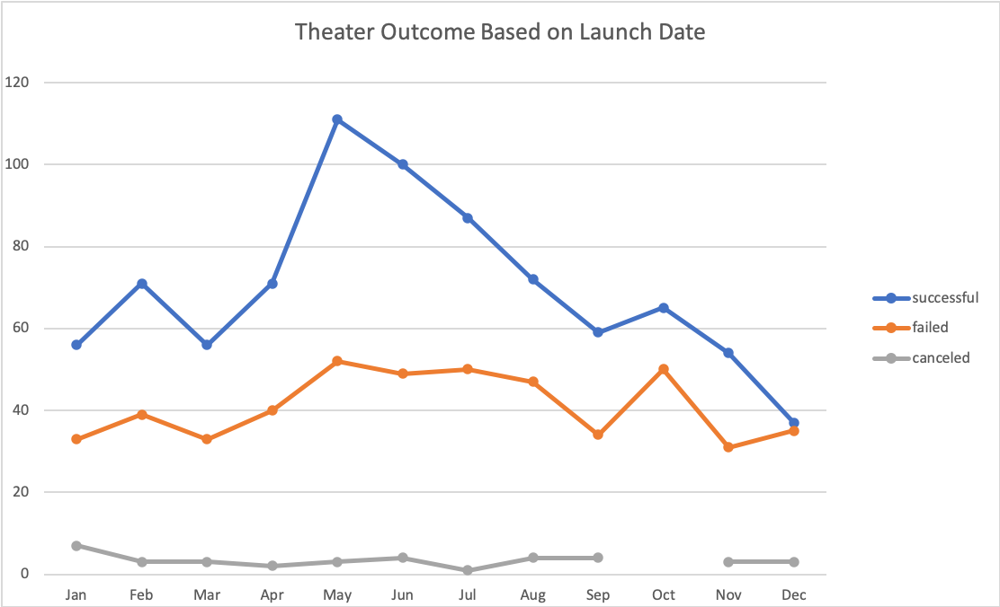
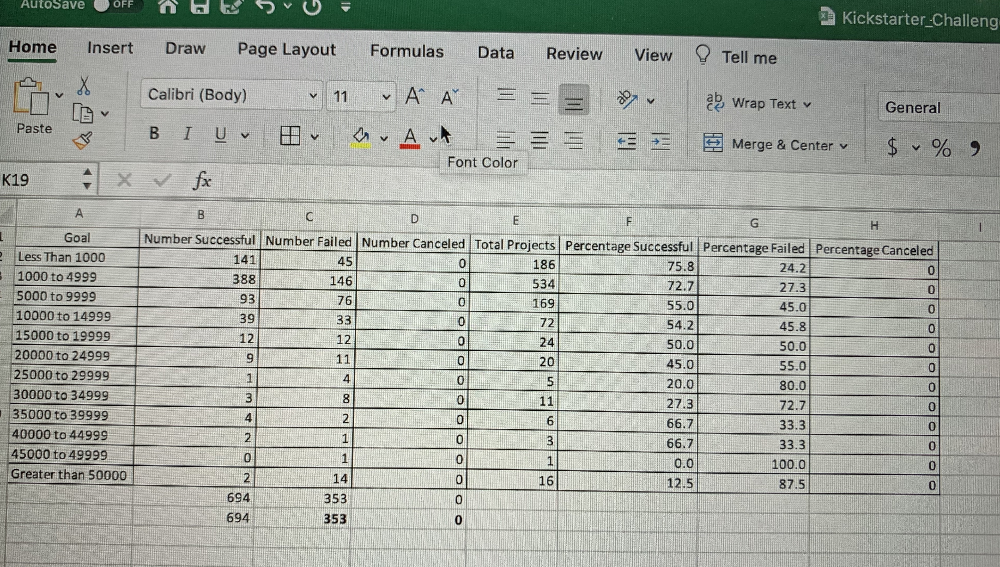
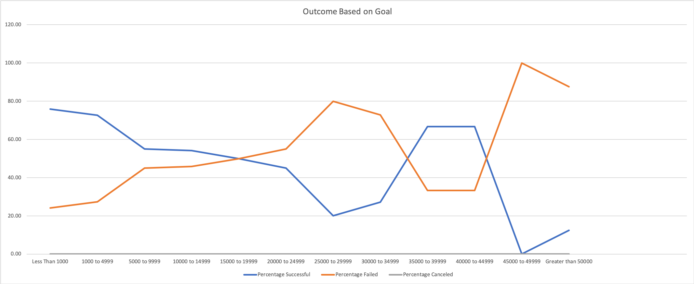

# Kickstarting with Excel
Performing analysis on Kickstarter data to uncover the trends
## Overview of Project
 Analyze the impact of launch dates and funding goals on the outcome.
### Purpose
Loise wants to know how different campaigns fared in relation to their launch dates and their funding goals.
## Analysis and Challenges

### Analysis of Outcomes Based on Launch Date
Based on Launch Date, The most successful campaigns were launched in May and June and the outcome falls towards the end of year.

### Analysis of Outcomes Based on Goals
Campaigns with smaller Goal amount were more successfull than others with larger Goal. Campaigns with the goal over 20000$ failed more.

### Challenges and Difficulties Encountered
Using COUNTIFS() was challenging for me when I was trying to check my result. I realized the Row title of Subcategory was changed in the formula and when I edit it, problem solved.

## Results

- What are two conclusions you can draw about the Outcomes based on Launch Date?
It is not a good idea for campaigns to Launch around end of the year. The most successful ones start in May!

- What can you conclude about the Outcomes based on Goals?
It is better to start with smaller Goal amount to get a better result.

- What are some limitations of this dataset?

- What are some other possible tables and/or graphs that we could create?

